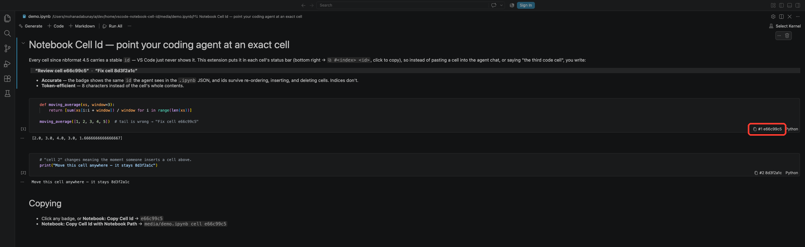

# Notebook Cell Id

Point your coding agent at an exact notebook cell: **"Review cell e66c99c5"**,
**"Fix cell 8d3f2a1c"**.

Every cell since nbformat 4.5 carries a stable `id`, but VS Code doesn't surface it
anywhere in its UI. This extension puts it in each cell's status bar and makes it one
click to copy.



## Why

When you ask an agent (or a colleague) to fix or review one cell, referencing it by id
beats every alternative:

- **Accurate.** The badge shows the same `id` field the agent sees when it opens the
  `.ipynb` JSON, so the reference resolves to exactly one cell. Ids survive re-ordering,
  inserting, and deleting cells — "the third code cell" and `cell 3` don't.
- **Token-efficient.** 8 characters instead of pasting the cell's whole contents into
  the chat to identify it.
- **Round-trippable.** VS Code's `ipynb` serializer preserves ids on save, so the id you
  copied yesterday still points at the same cell today.

## Features

- A right-aligned status bar item on every cell: `⧉ #5 e66c99c5` (index + cell id).
- Click it to copy the id.
- Commands from the Command Palette, acting on the selected cell (the extension adds
  nothing to the cell toolbar or its `...` menu — those stay exactly as VS Code ships them):
  - **Notebook: Copy Cell Id** → `e66c99c5`
  - **Notebook: Copy Cell Id with Notebook Path** → `article_mat/v2_nb/step_3_.ipynb cell e66c99c5`

## Settings

| Setting | Default | Notes |
| --- | --- | --- |
| `notebookCellId.showStatusBarItem` | `true` | Turn the per-cell badge off, keep the commands. |
| `notebookCellId.statusBarLabel` | `index-and-id` | Also accepts `id` or `index`. |

## Requirements

Cells only carry ids in **nbformat 4.5 and newer**. Older notebooks show no badge; re-saving
them in a current Jupyter or VS Code will add ids. Works on `jupyter-notebook` and
`interactive` documents.

## How it works

VS Code's built-in `ipynb` extension deserializes the nbformat cell id onto
`NotebookCell.metadata.id`, and writes it back on save. The extension reads that through
a `NotebookCellStatusBarItemProvider`, so the badge tracks cells as you add, delete, and
move them — no file parsing, nothing to keep in sync. Some older VS Code builds nested the
value under `metadata.custom.id`; both are checked.

## Development

```bash
git clone https://github.com/hannody/vscode-notebook-cell-id.git
cd vscode-notebook-cell-id
npm install          # only needed for the vsce/type devDependencies
```

Press <kbd>F5</kbd> in VS Code to launch an Extension Development Host with the extension
loaded, then open any `.ipynb`. Plain JavaScript, no build step.

To run it in your day-to-day VS Code instead, symlink the folder into your extensions
directory and reload the window:

```bash
ln -sfn "$PWD" ~/.vscode/extensions/local.notebook-cell-id-0.1.0
```

## License

MIT
